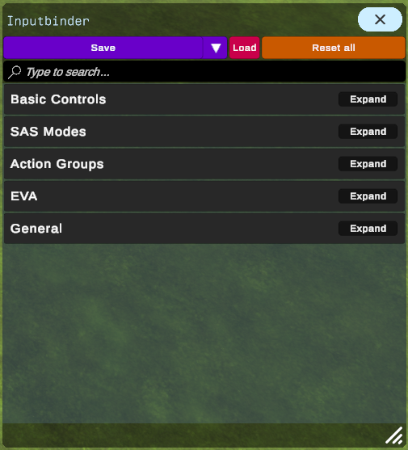

# Inputbinder

### Jump to section

* [Description](#description)
* [How to install](#how-to-install)
* [How to build](#how-to-build)
* [Main features](#main-features)
* [Configuration](#configuration)
  * [Where are my bindings stored?](#where-are-my-bindings-stored)
  * [Reset the configuration](#reset-the-configuration)
  * [Slider settings](#slider-settings)
  * [Adding more actions from the game to Inputbinder](#adding-more-actions-from-the-game-to-inputbinder)
* [Bug Reports and Feature Requests](#bug-reports-and-feature-requests)
* [More info](#more-info)

## Description

Inputbinder aims to allow users to bind their input devices to the various game actions. It comes with a UI accessible through the game's in-flight app bar:

__Inputbinder in the App-Bar menu__  

__Inputbinder App__  

## How to install

* Option 1: Use [CKAN](https://github.com/KSP-CKAN/CKAN) to install _(recommended)_
* Option 2: Follow instructions below to install manually

### Prerequisites

* Install [BepInEx](https://docs.bepinex.dev/articles/user_guide/installation/index.html), skip if already installed

### Instructions

* Unpack the contents of the downloaded `.zip` file into your KSP 2 installation (eg. `C:\Program Files (x86)\Steam\steamapps\common\Kerbal Space Program 2`)

## How to build

Currently only Windows is supported.

### Prerequisites

* [Python 3.5 or newer](https://www.python.org/downloads/)
* [.NET Framework 4.7.2](https://dotnet.microsoft.com/en-us/download/dotnet-framework/net472)
* [Unity 2020.3.33](https://unity.com/releases/editor/archive)
* [BepInEx](https://docs.bepinex.dev/articles/user_guide/installation/index.html) installed to KSP 2

### Instructions

* Clone this repository to a location of your choice

* Add a new environment variable named `KSP2_PATH` with the value set to the path to your installation of KSP 2 (eg. `C:\Program Files (x86)\Steam\steamapps\common\Kerbal Space Program 2`)

* Run `build.bat`

#### build.bat usage

`build.py [-h] [-e UNITY_EXECUTABLE] [-i] [-s] [-d] [-n] [--skip-assembly-build] [--skip-assets]`
  
  | Option                                                   | Description |
  |----------------------------------------------------------|-------------|
  | -h, --help                                               | show this help message and exit |
  | -e UNITY_EXECUTABLE, --unity-executable UNITY_EXECUTABLE |If your unity installation is not located at `C:/Program  Files/Unity/Hub/Editor/2020.3.33f1/Editor/Unity.exe` use this option|
  |-i, --install                                             |Install this mod|
  |-s, --start                                               |Install and start this mod, --install is redundant when using this option|
  |-d, --debug                                               |Produces a debug build with full debug information|
  |-n, --no-archive                                          |Do not create an archive file when completed|
  |--skip-assembly-build                                     |Skips the assembly build|
  |--skip-assets                                             |Skips the addressables build|

## Main features

* Directly modifies the game's bindings using the [InputSystem](https://docs.unity3d.com/Packages/com.unity.inputsystem@1.5/manual/index.html)
* Change game bindings
* Add [processors](https://docs.unity3d.com/Packages/com.unity.inputsystem@1.5/manual/Processors.html) to your bindings
* Makes gamepads usable

### Custom actions created by Inputbinder

#### Throttle
* Throttle Axis: Control your throttle as an axis

#### Trim
Dedicated actions to change the trim
* Pitch Trim
* Roll Trim
* Yaw Trim
* Trim Reset

## Configuration

The mod settings can be accessed in-game in the flight view.

### Where are my bindings stored?

The bindings and processors are stored in the folder `Kerbal Space Program 2/BepInEx/config/inputbinder/profiles` inside `.json` files. Every file holds a complete set of all bindings. You can back up an individual file or rename it and put it back when you need to. By clicking "Load" inside the mod app it loads the file named `input.json`

### Reset the configuration

To reset all bindings click the "Reset All" button in the app's title bar.

### Slider settings

To change the range of the sliders inside the processor editing menus, open the file `Kerbal Space Program 2/BepInEx/config/inputbinder/inputbinder.cfg` inside a text editor.  
Now change the values after `SliderMin=` and `SliderMax=` to suit your needs.  
Then save the file and restart your game.

### Adding more actions from the game to Inputbinder

It is possible to change the bindings for other game actions too.

* Create this file: `Kerbal Space Program 2/BepInEx/config/inputbinder/game_actions_to_add.txt`

* Follow [this page](https://github.com/Codenade/ksp2-inputbinder/wiki/Configuration#game_actions_to_addtxt) to add what you want

* Save the file and restart your game

## Bug Reports and Feature Requests

Found any bugs? Have an idea to improve things? => [Open an issue on GitHub](https://github.com/Codenade/ksp2-inputbinder/issues/new).

## More info

For more information see: https://github.com/Codenade/ksp2-inputbinder/wiki
